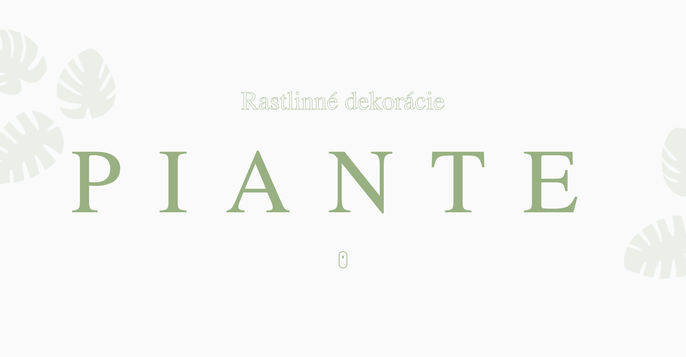

# EnergyCode - Black-fish

## Table of contents

- [Overview](#overview)

  - [The challenge](#the-challenge)

- [My process](#my-process)
  - [Built with](#built-with)
  - [What I learned](#what-i-learned)

## Overview

This website was designed and developed by me!
To be honest, I am not 100% satisfied with the result. I think I have started with the wrong approach considering the complexity of animations.
To be specific, I am not satisfied with responsiveness, which a was challenge to maintain because of the complexity of animations and the wrong approach to those animations from the very beginning.

Live Site URL: [PIANTE](https://piante-web-1.netlify.app)

## Screenshot

## My process

- I designed my own design in Figma
- Started by creating a basic layout.
- Added animations with Framer Motion to create smooth and interactive user experiences.
- Tried to make the responsiveness as good as I could.

### Built with

- React.js
- Tailwind
- Vite
- Framer motion
- [React](https://reactjs.org/) - JS library

### What I learned

- Smooth scrolling techniques.
- How not to approach responsive design.
- Framer Motion: Applied Framer Motion for advanced animations and transitions, improving the interactivity and smoothness of the UI.
- Scroll-triggered animations.
